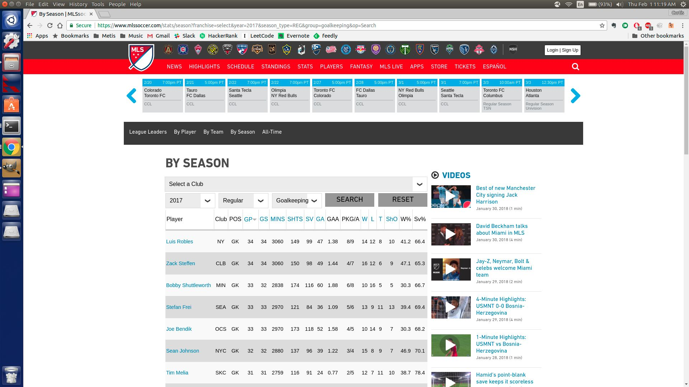
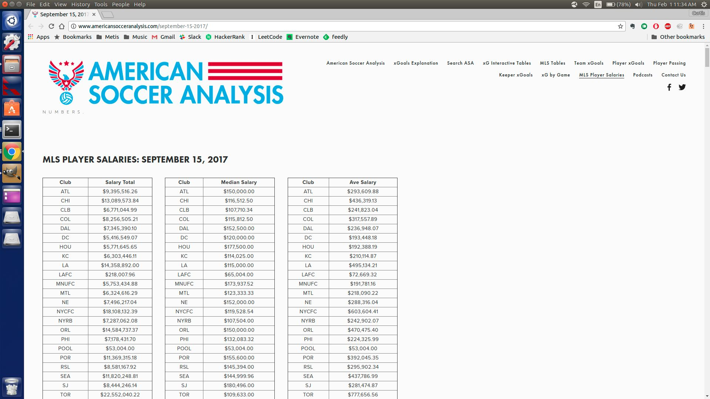
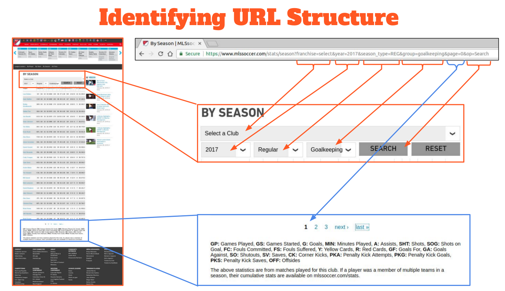
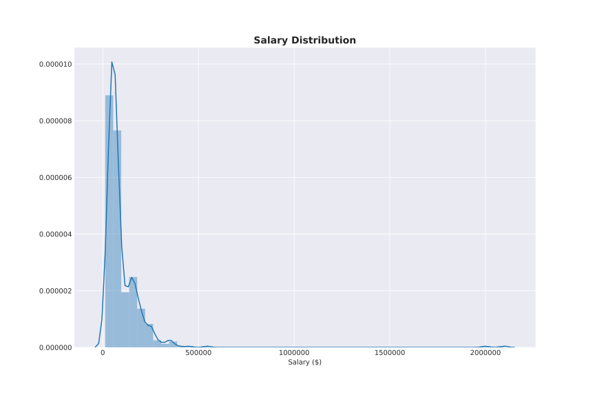
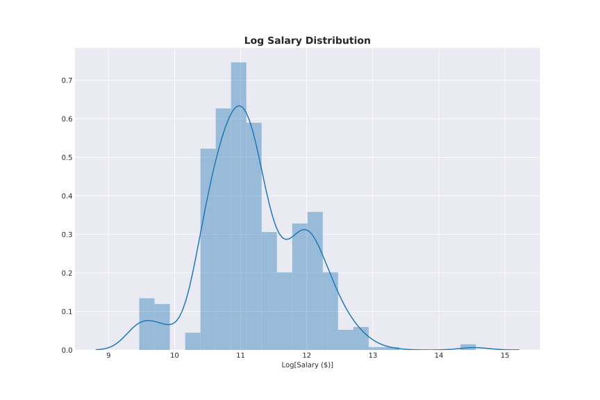
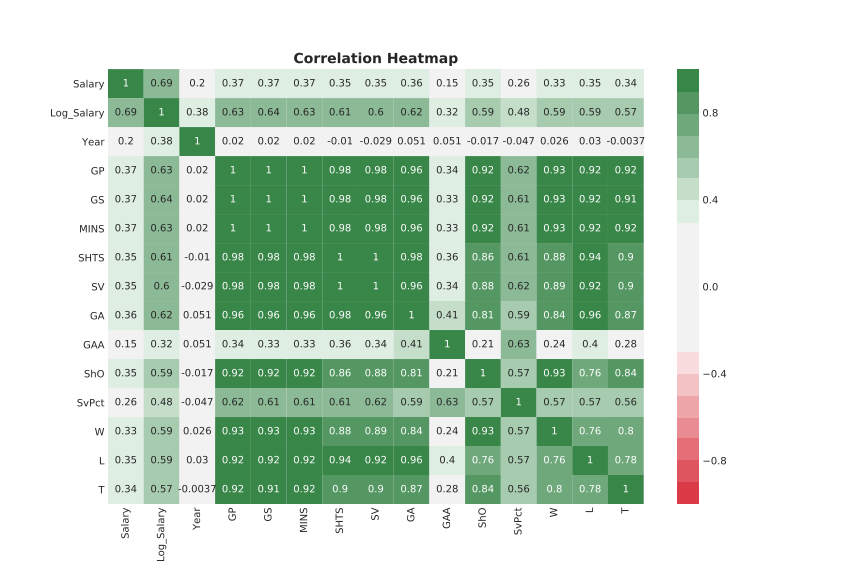
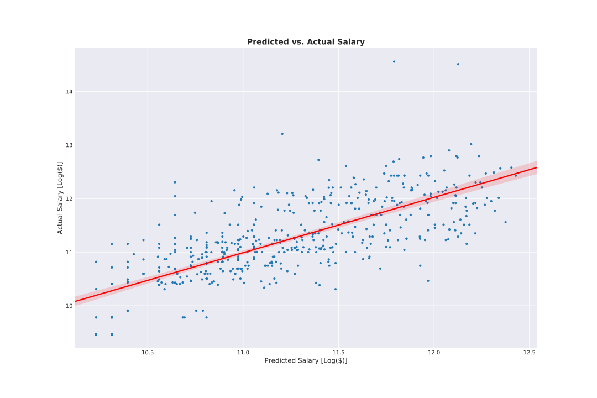
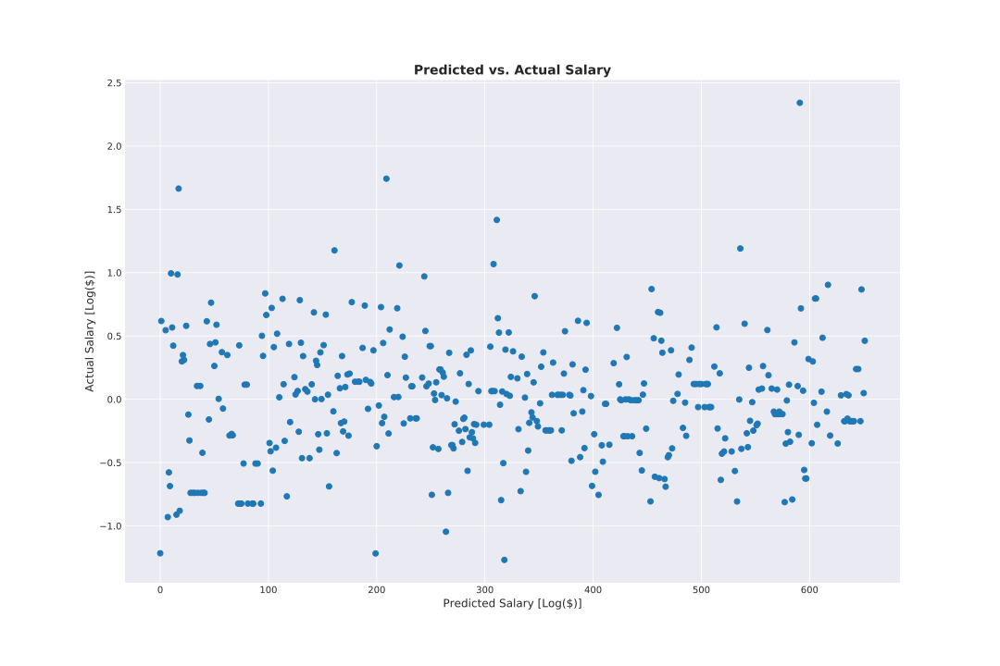
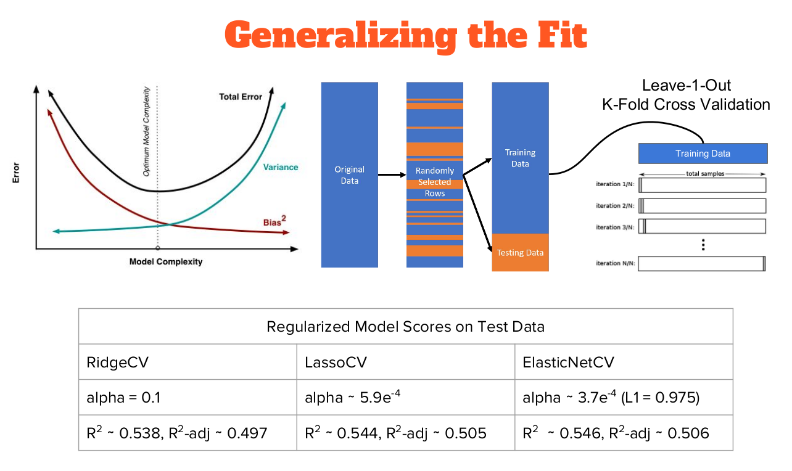

# Getting What They Paid For

## Background

## Data Overview

### Data Sources

### Descriptions

#### Features

* Year: Year Salary was Paid Out
* GP: Games Played
* GS: Games Started
* MINS: Minutes Played
* SHTS: Shots Against
* SV: Saves
* GA: Goals Against
* GAA: Goals Against Average
* ShO: Shutouts
* SvPct: Save Percentage
* W: Wins
* L: Losses
* T: Ties

#### Target

* Salary: Yearly Salary in US Dollars
* Log_Salary: Log[Yearly Salary in US Dollars]

## Methodology

1. Data Munging
1. Exploratory Analysis
1. Modeling & Evaluation

## 1. Data Munging

### Scraping

### Cleaning

### Linking

## 2. Exploratory Analysis

### Descriptive Statistics

|       |       Salary |   Log_Salary |     Year |      GP |      GS |    MINS |    SHTS |      SV |      GA |     GAA |     ShO |   SvPct |       W |       L |       T |
|:------|-------------:|-------------:|---------:|--------:|--------:|--------:|--------:|--------:|--------:|--------:|--------:|--------:|--------:|--------:|--------:|
| count |    579       |      579     |  579     | 579     | 579     |  579    | 579     | 579     | 579     | 579     | 579     | 579     | 579     | 579     | 579     |
| mean  |  99405.2     |       11.19  | 2012.54  |  10.789 |  10.663 |  959.05 |  49.06  |  33.675 |  14.402 |   1.006 |   2.805 |  45.249 |   3.921 |   3.869 |   2.86  |
| std   | 136212       |        0.744 |    3.098 |  12.412 |  12.436 | 1114.92 |  57.317 |  39.906 |  16.744 |   0.898 |   3.671 |  32.815 |   5.052 |   4.666 |   3.666 |
| min   |  12900       |        9.465 | 2007     |   0     |   0     |    0    |   0     |   0     |   0     |   0     |   0     |   0     |   0     |   0     |   0     |
| 25%   |  46500       |       10.747 | 2010     |   0     |   0     |    0    |   0     |   0     |   0     |   0     |   0     |   0     |   0     |   0     |   0     |
| 50%   |  65004       |       11.082 | 2013     |   4     |   3     |  308    |  16     |  11     |   6     |   1.13  |   1     |  62.7   |   1     |   2     |   1     |
| 75%   | 125000       |       11.736 | 2015     |  23     |  23     | 2067    | 101     |  69.5   |  28.5   |   1.5   |   5     |  69.85  |   7     |   7     |   5     |
| max   |      2.1e+06 |       14.557 | 2017     |  34     |  34     | 3060    | 191     | 146     |  60     |   6     |  15     | 100     |  20     |  19     |  18     |

### Target Distribution

### Feature Distributions

### Feature Correlation

## 3. Model Building & Evaluation

### Linear Regression

### Generalizing Fit

## Challenges & Improvements

### Issues Encountered

* Salary is often fixed for several years at a time due to contract structure.

* Extreme outliers skew the distribution of salaries positively and the available features are unable explain this variance.

* Many players bring intangible value to their teams that isn’t captured in their stats.

* Data integrity issues (errors in the MLS database)

### Possible Solutions

* Add additional features to the dataset:

  * Contract signing year and any performance incentives.

  * Complete player history, not just their time in the MLS (i.e., international experience, time in other leagues)

* Data validation with other sources.

## Future Work

* Continue to refine and update data.

* Explore additional data sources.
