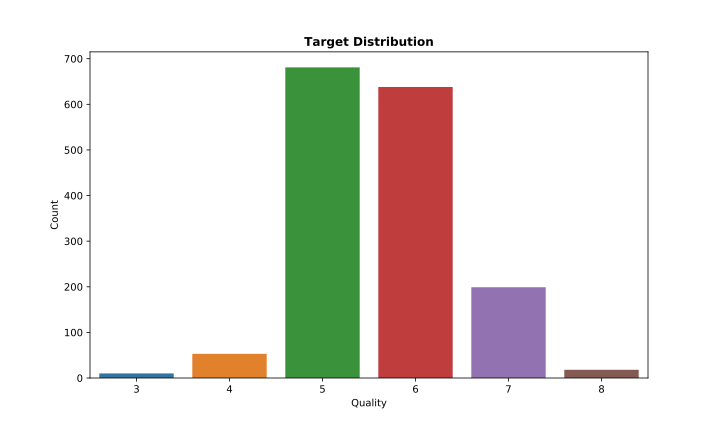
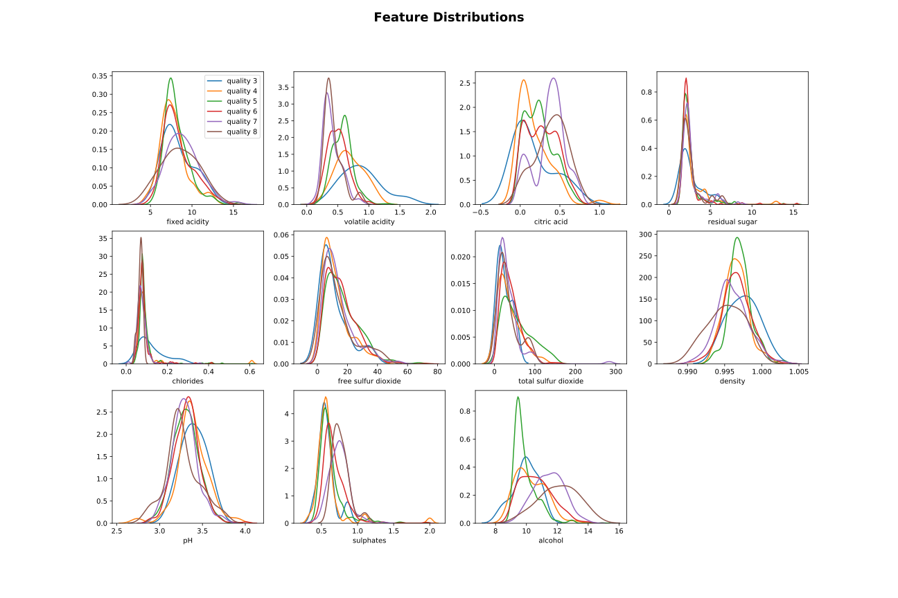
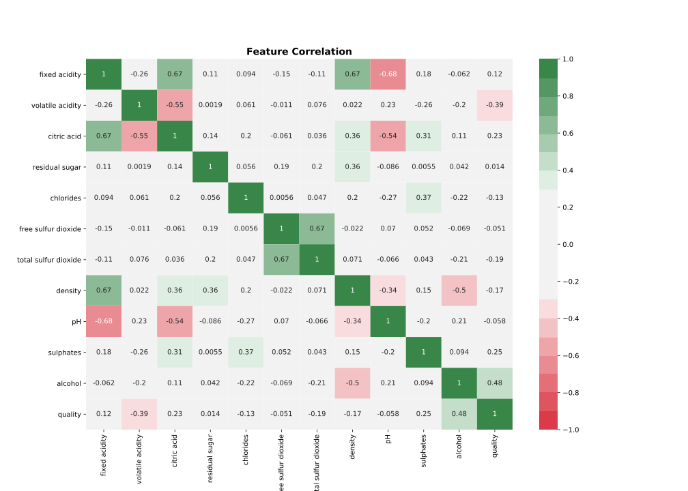
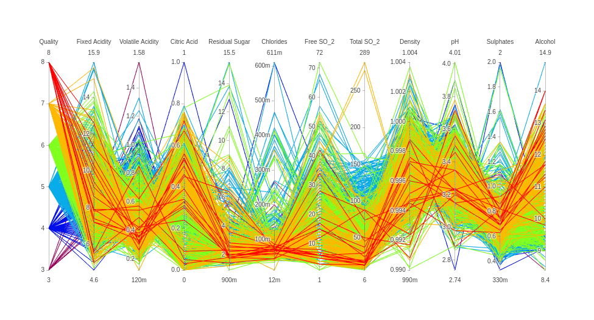
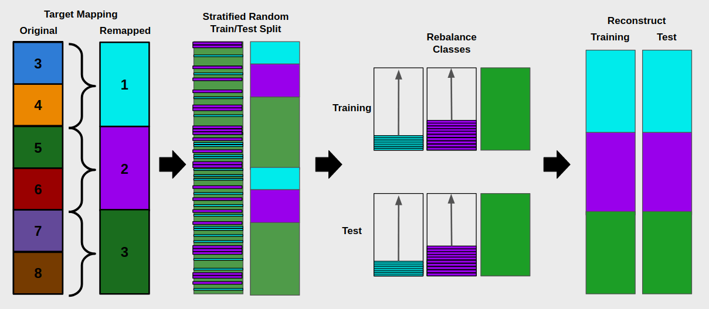
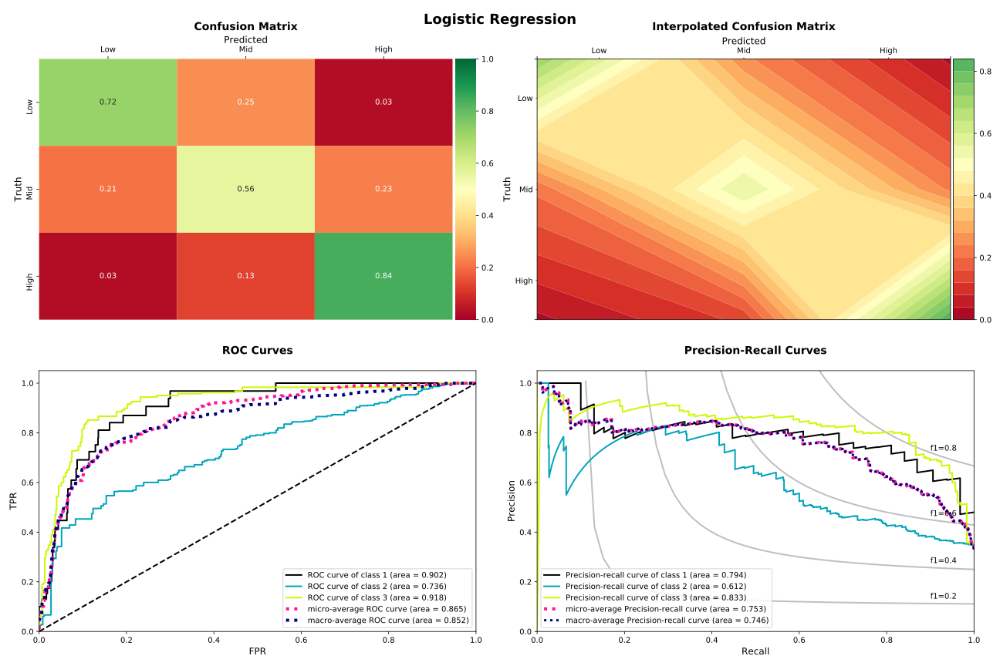
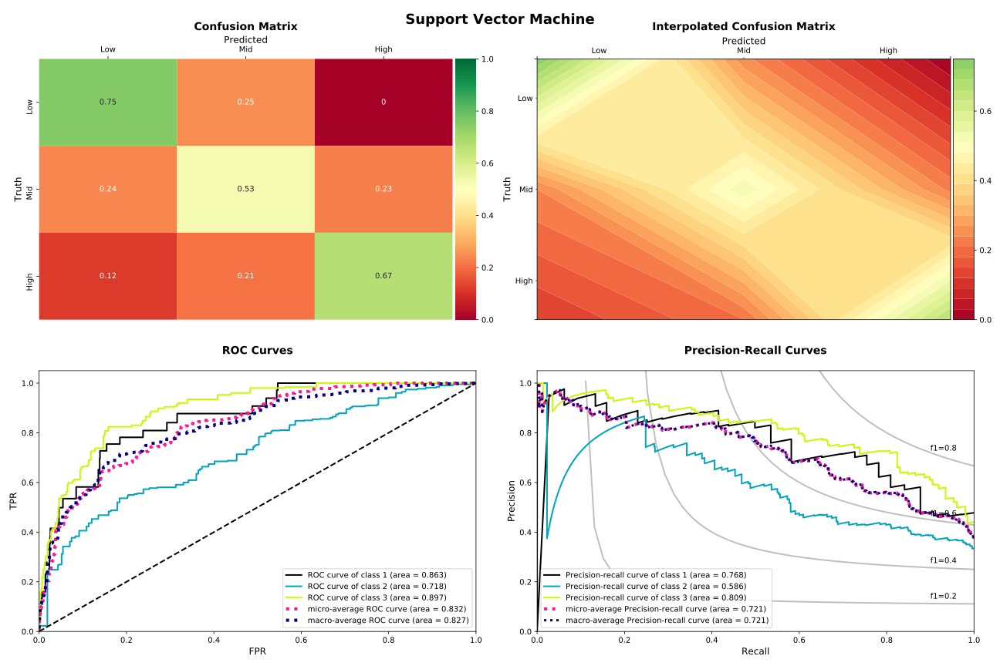
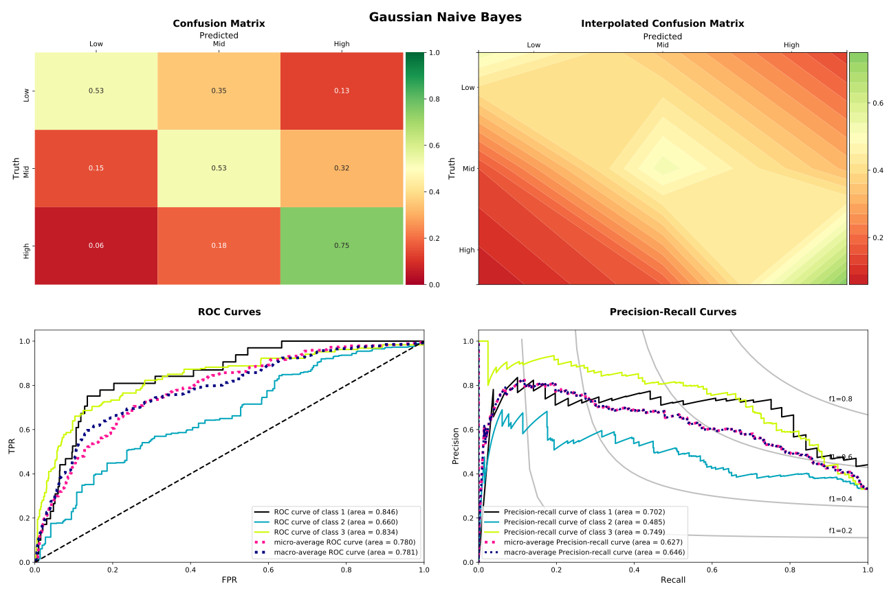

# Wine Ratings: Science or Bullshit?

## Background

Wine quality is often evaluated via a professional sommelier. It is hypothesized that if there is a scientific methodology behind these reviews that a predictive model can be built using the combined results from various physicochemical tests (e.g., pH, percent alcohol, density, etc.).

## Data Overview

The dataset used is related to the red variant of the Portuguese "Vinho Verde" wine.

Note: Due to privacy and logistic issues, only physicochemical (inputs) and sensory (the output) variables are provided (e.g. there is no data about grape types, wine brand, wine selling price, etc.).

### Source

UCI Machine Learning Repository [https://archive.ics.uci.edu/mldatasets/Wine+Quality].  
Irvine, CA: University of California, School of Information and Computer Science.

### Reference

P. Cortez, A. Cerdeira, F. Almeida, T. Matos and J. Reis. (2009)
Modeling wine preferences by data mining from physicochemical properties. In Decision Support Systems, Elsevier, 47(4):547-553, 2009.

### Descriptions

#### Features

The input features are interval data based on 11 physicochemical tests.

1. Fixed Acidity: most acids involved with wine or fixed or nonvolatile (do not evaporate readily)

1. Volatile Acidity: the amount of acetic acid in wine, which at too high of levels can lead to an unpleasant, vinegar taste

1. Citric Acid: found in small quantities, citric acid can add 'freshness' and flavor to wines

1. Residual Sugar: the amount of sugar remaining after fermentation stops, it's rare to find wines with less than 1 gram/liter and wines with greater than 45 grams/liter are considered sweet

1. Chlorides: the amount of salt in the wine

1. Free Sulfur Dioxide: the free form of SO2 exists in equilibrium between molecular SO2 (as a dissolved gas) and bisulfite ion; it prevents microbial growth and the oxidation of wine

1. Total Sulfur Dioxide: amount of free and bound forms of S02; in low concentrations, SO2 is mostly undetectable in wine, but at free SO2 concentrations over 50 ppm, SO2 becomes evident in the nose and taste of wine

1. Density: the density of water is close to that of water depending on the percent alcohol and sugar content

1. pH: describes how acidic or basic a wine is on a scale from 0 (very acidic) to 14 (very basic); most wines are between 3-4 on the pH scale

1. Sulphates: a wine additive which can contribute to sulfur dioxide gas (S02) levels, wich acts as an antimicrobial and antioxidant

1. Alcohol: the percent alcohol content of the wine

#### Target

The output target is an ordinal score based on sensory data.

* Quality: score from 0 to 10

## Methodology

1. Exploratory Analysis
1. Data Preprocessing
1. Modeling & Evaluation

## 1. Exploratory Analysis

### Descriptive Statistics

|      |   Fixed Acidity |   Volatile Acidity |   Citric Acid |   Residual Sugar |   Chlorides |   Free Sulfur Dioxide |   Total Sulfur Dioxide |   Density |    pH |   Sulphates |   Alcohol |   Quality |
|:-----|----------------:|-------------------:|--------------:|-----------------:|------------:|----------------------:|-----------------------:|----------:|------:|------------:|----------:|----------:|
| mean |           8.32  |              0.528 |         0.271 |            2.539 |       0.087 |                15.875 |                 46.468 |     0.997 | 3.311 |       0.658 |    10.423 |     5.636 |
| std  |           1.741 |              0.179 |         0.195 |            1.41  |       0.047 |                10.46  |                 32.895 |     0.002 | 0.154 |       0.17  |     1.066 |     0.808 |
| min  |           4.6   |              0.12  |         0     |            0.9   |       0.012 |                 1     |                  6     |     0.99  | 2.74  |       0.33  |     8.4   |     3     |
| 25%  |           7.1   |              0.39  |         0.09  |            1.9   |       0.07  |                 7     |                 22     |     0.996 | 3.21  |       0.55  |     9.5   |     5     |
| 50%  |           7.9   |              0.52  |         0.26  |            2.2   |       0.079 |                14     |                 38     |     0.997 | 3.31  |       0.62  |    10.2   |     6     |
| 75%  |           9.2   |              0.64  |         0.42  |            2.6   |       0.09  |                21     |                 62     |     0.998 | 3.4   |       0.73  |    11.1   |     6     |
| max  |          15.9   |              1.58  |         1     |           15.5   |       0.611 |                72     |                289     |     1.004 | 4.01  |       2     |    14.9   |     8     |

### Target Distribution

How are the target classes distributed? Looks like the data is very imbalanced, with most scores in the middle. This will need to be addressed during preprocessing before building classification models.

### Feature Distributions

What do the features look like? It doesn't appear that much insight can be gained by looking at statistics without breaking them down by target class. So, let's look at the target class distributions for each feature. This provides a better sense of the data, showing just how densely overlapped the target classes are in feature space, especially neighboring classes. The target classes are essentially perfectly overlapped in nearly every feature dimension, which means it's going to be difficult to separate the target classes.

### Feature Correlation

What about feature correlations? It appears that several features have high correlations; therefore, selection will need to be explored during the modelling process.

### Relationship Exploration

What about higher-dimensional relationships? We can use an interactive parallel coordinates plot to explore the n-dimensional feature relationships for each record in the dataset.
No additional insights are readily apparent; rather it basically confirms what were already know about the dense overlap of the target classes.

## 2. Data Preprocessing

Based on the class imbalance discovered during data exploration, the target variable was remapped from six to three classes in order to provide a richer set of baseline information in each minority class. Even with this remapping of the target, the minority classes were still very small, especially in relation to the majority class; therefore, a stratified 50-50 train-test split was executed to maximize the signal in the minority classes prior to upsampling to balance the classes.

## 3. Model Building & Evaluation

Three classification techniques were applied. Logistic Regression achieved the best results, followed by the support vector machine, and then the gaussian naive bayes approach. None of the models were able to perfectly classify the wines into their respecitive quality scores; however, they did reasonably approximate what we would expect from a professional sommelier.

Wine tasting is a very subjective endeavor in which different sommeliers rate the same wines slightly differently, creating an expected scoring spectrum. Relaxing the interpretation of the classification results summarized in the confusion matrices, it is clear that each model approximates the scoring spectrum we would expect to see in real life.

### Logistic Regression

### Support Vector Machines

### Naive Bayes

## Conclusion

**Wine Tasting is at best pseudo-science**, as it is almost entirely subjective, and it can be influenced by so many other factors. We taste with our eyes, ears, noses, and even our sense of touch. We taste with our emotions, and our state of mind. This has been demonstrated time after time after time.

With that said, it appears the models were able to pick-up on the underlying signal in the data which allowed them to approximate the scoring spectrum we would expect from a professional sommelier compared to their peers, in which most ratings are in agreement, but some may be slightly higher or lower.

## Challenges & Lessons Learned

* Traditional performance metrics are not as interpretable for multinomial classification (One-vs-Rest creates artificial class imbalance which skews performance metrics)

* Ordinal classes can bleed into each other (especially when target is qualitative)

## Future Work

* Continue to explore an ordinal regression approach. Using the `mord` package didn't work particularly well; however, it's not a particularly robust implementation. It would be worthwhile to explore `rpy` since the R ecosystem seems to have a more robust implementation of ordinal regression.

* Explore principal component analysis methods to see if there exists an orthogonal set of dimensions that may be able to provide better separation of the target classes and thus better classification performance.
